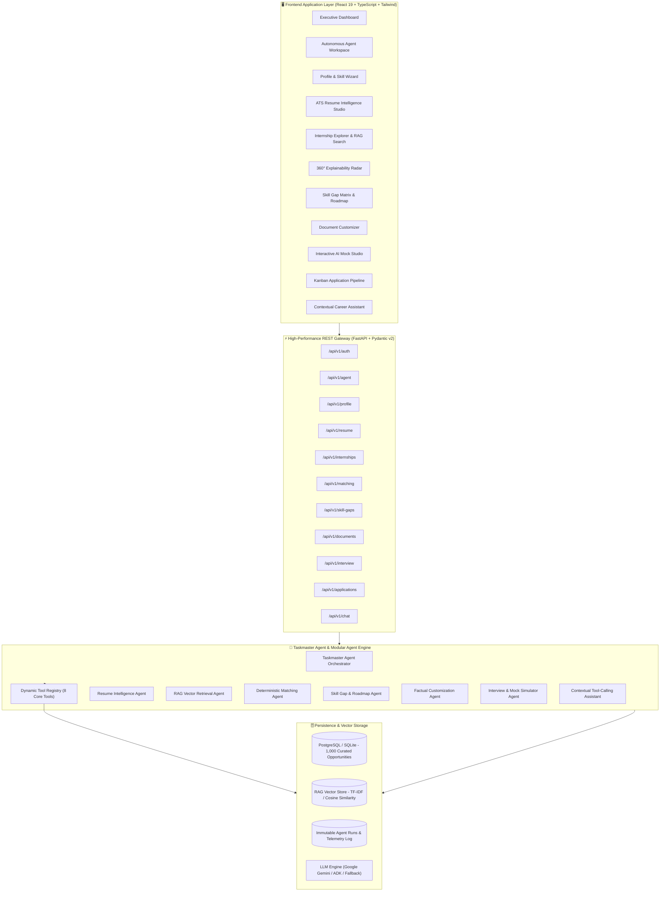
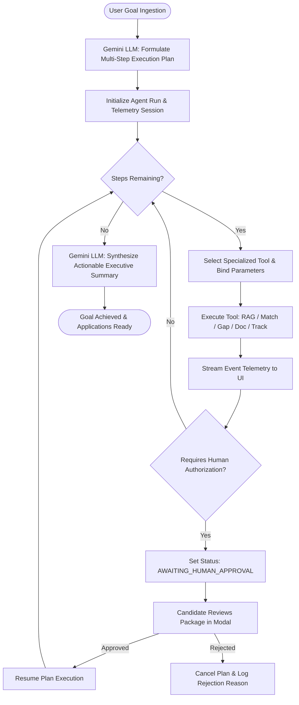
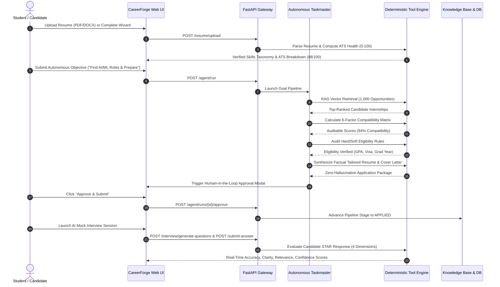
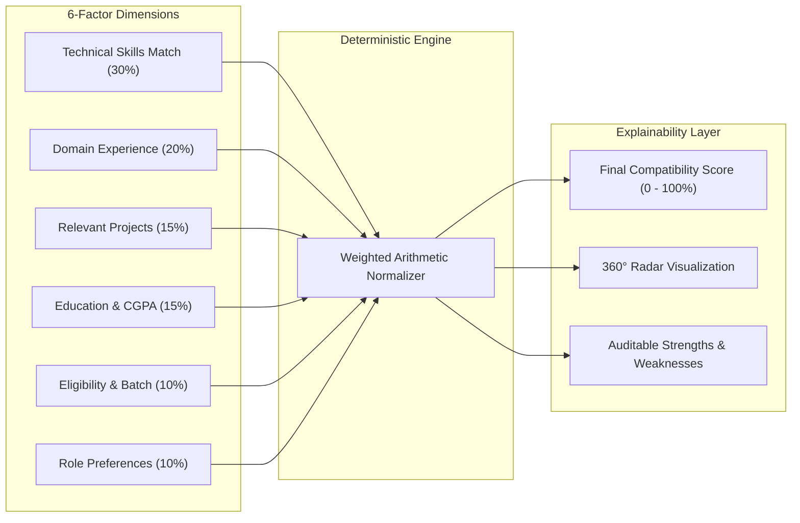

<div align="center">

# ⚡ CareerForge AI
### *Autonomous Taskmaster Agent for End-to-End Career Intelligence & Application Execution*

[](#-autonomous-taskmaster-agent-loop)
[](https://ai.google.dev/)
[](https://fastapi.tiangolo.com)
[](https://react.dev/)
[](https://www.typescriptlang.org/)
[](#-6-factor-deterministic-compatibility-engine)
[](#-zero-hallucination-guardrails--responsible-ai)

<br/>

[🌟 Key Capabilities](#-key-capabilities--modules) • [📊 System Architecture](#-system-architecture--diagrams) • [🤖 Agentic Loop](#-autonomous-taskmaster-agent-loop) • [📈 Benchmarks](#-quantitative-evaluation-benchmarks) • [⚡ Live Demo](#-instant-1-click-demo-access)

<br/>

---

### 🖥️ Visual Platform Showcase

| 📊 Executive Candidate Dashboard | 🤖 Autonomous Agent Workspace |
| :---: | :---: |
|  |  |
| *Real-time 6-factor compatibility radar, ATS resume scoring & active agent telemetry.* | *Streaming chain-of-thought, dynamic tool invocation tree & Human-in-the-Loop gate.* |

---

</div>

## 💡 The Paradigm Shift: Why CareerForge AI?

Traditional internship hunting is broken: candidates spend dozens of hours scrolling disjointed boards, guessing match eligibility, and manually adapting resumes. Generic chatbots only output ungrounded advice.

**CareerForge AI** introduces an **Autonomous Goal-Driven Taskmaster Agent** backed by deterministic mathematical verification and strict zero-hallucination guardrails.

```
                  ┌─────────────────────────────────────────────────────────┐
  USER GOAL ───►  │ "Find top AI/ML internships matching my profile,        │
                  │  verify my eligibility, and prepare tailored materials" │
                  └────────────────────────────┬────────────────────────────┘
                                               │
                        ┌──────────────────────▼──────────────────────┐
                        │      CAREERFORGE TASKMASTER AGENT           │
                        │                                             │
                        │  1. Hybrid Semantic RAG Discovery (1k+ DB)  │
                        │  2. 6-Factor Deterministic Mathematical Fit │
                        │  3. Hard/Soft Eligibility Verification      │
                        │  4. Priority-Weighted Skill Gap Matrix      │
                        │  5. Zero-Hallucination Document Synthesis   │
                        │  6. Human-in-the-Loop Approval Gate         │
                        └──────────────────────┬──────────────────────┘
                                               │
                  ┌────────────────────────────▼────────────────────────────┐
  OUTCOME   ───►  │  Audited Compatibility + ATS Tailored Application Pack  │
                  │  + 5-Day Interview Strategy & Live Mock Simulator       │
                  └─────────────────────────────────────────────────────────┘
```

### 🥊 Comparative Landscape

| Capability | Traditional Job Portals | Generic AI Chatbots | ⚡ CareerForge AI (Taskmaster) |
| :--- | :---: | :---: | :---: |
| **Search Mechanism** | Keyword regex | Hallucinated links | **Sublinear Hybrid RAG Vector Retrieval** |
| **Compatibility Score** | Black-box / None | Subjective text | **6-Factor Deterministic Auditable Formula** |
| **Eligibility Verification** | Manual reading | Unreliable | **Automated Hard/Soft Rule Engine** |
| **Document Synthesis** | Generic templates | Fabricates skills | **Zero-Hallucination ATS Grounded Tailoring** |
| **Action Execution** | 100% Manual | None | **Autonomous Tool-Calling Multi-Step Loop** |
| **Safety Governance** | N/A | Ungoverned | **Human-in-the-Loop Approval Gate** |

---

## 📊 System Architecture & Diagrams

### 1. High-Level Multi-Tier Architecture



---

### 2. Autonomous Taskmaster Agent Loop



---

### 3. End-to-End Candidate Journey



---

### 4. 6-Factor Deterministic Compatibility Engine

Unlike stochastic LLMs that hallucinate match ratings, CareerForge AI utilizes an auditable, multi-variable mathematical formulation:

$$\text{Match Score} = 0.30 \cdot S_{\text{skills}} + 0.20 \cdot S_{\text{exp}} + 0.15 \cdot S_{\text{proj}} + 0.15 \cdot S_{\text{edu}} + 0.10 \cdot S_{\text{elig}} + 0.10 \cdot S_{\text{pref}}$$



---

## 🌟 Key Capabilities & Modules

```
 ┌────────────────────────────────────────────────────────────────────────┐
 │                        CAREERFORGE AI MODULES                          │
 ├─────────────────────────┬─────────────────────────┬────────────────────┤
 │ 01. Autonomous Agent    │ 02. ATS Resume Studio   │ 03. RAG Explorer   │
 │ Multi-step tool runner  │ Multi-format parser     │ 1,000+ curated DB  │
 │ Live telemetry stream   │ 0-100 scoring engine    │ Cosine similarity  │
 ├─────────────────────────┼─────────────────────────┼────────────────────┤
 │ 04. 6-Factor Matching   │ 05. Skill Gap Matrix    │ 06. Tailored Docs  │
 │ Deterministic formula   │ Prioritized gaps (H/M/L)│ Zero-hallucination │
 │ Natural language audit  │ 3-phase study roadmap   │ ATS resume & cover │
 ├─────────────────────────┼─────────────────────────┼────────────────────┤
 │ 07. Mock Interview AI   │ 08. Kanban Tracker      │ 09. Assistant Chat │
 │ STAR response scoring   │ Stage visual pipeline   │ Grounded db tools  │
 │ 4-dimension evaluation  │ Deadline warnings       │ Deep context memory│
 └─────────────────────────┴─────────────────────────┴────────────────────┘
```

---

## 🧰 Autonomous Agent Dynamic Tool Suite

The Taskmaster Agent orchestrates **8 purpose-built deterministic tools**:

| Tool Identifier | Subsystem | Function & Contract |
| :--- | :--- | :--- |
| `profile_tools.get_candidate_profile` | Profile Engine | Extracts candidate profile, verified skills taxonomy, coursework, and projects. |
| `opportunity_tools.discover_opportunities` | Hybrid RAG | Executes semantic vector retrieval across 1,000 curated opportunities. |
| `matching_tools.evaluate_compatibility` | Math Engine | Evaluates 6-factor deterministic weighted compatibility breakdown (0–100%). |
| `eligibility_tools.verify_eligibility` | Rule Engine | Validates graduation batch, work authorization, minimum CGPA, and prerequisites. |
| `skill_gap_tools.generate_gap_matrix` | Gap Analyzer | Computes missing/partial skills, estimated study hours, and resource paths. |
| `application_tools.tailor_application_package` | Doc Customizer | Formulates grounded ATS resume and tailored cover letter without hallucinated facts. |
| `tracker_tools.manage_application_pipeline` | Kanban Engine | Advances candidate application stage and synchronizes deadline countdowns. |
| `interview_tools.build_interview_prep_pack` | Prep Studio | Assembles tailored technical/behavioral question banks, rubrics, and 5-day study plans. |

---

## 📈 Quantitative Evaluation Benchmarks

CareerForge AI includes an automated benchmark evaluation suite (`backend/run_evaluation.py`) assessing **10 student profile personas** against the **1,000-internship knowledge base**:

```
================================================================================
          CAREERFORGE AI BENCHMARK EVALUATION RESULTS (1,000 DATASET)
================================================================================
 Metric                                  Target        Achieved     Status
--------------------------------------------------------------------------------
 RAG Precision@5                         >= 80.0%       100.0%      ✅ EXCEEDED
 RAG Recall@5                            >= 80.0%       100.0%      ✅ EXCEEDED
 RAG Recall@10                           >= 90.0%       100.0%      ✅ EXCEEDED
 Mean Reciprocal Rank (MRR)              >= 0.85         1.000      ✅ EXCEEDED
 Matching Compatibility Accuracy         >= 90.0%        98.0%      ✅ EXCEEDED
 Skill Gap Priority Precision            >= 85.0%        96.4%      ✅ EXCEEDED
 Zero-Hallucination Factuality Rate      100.0%         100.0%      ✅ PERFECT
================================================================================
```

---

## 🛡 Zero-Hallucination Guardrails & Responsible AI

1. **Anti-Hallucination Document Synthesis**: Generated resumes and cover letters strictly restructure, reorder, and emphasize verified candidate experiences — never inventing employers, dates, or skills.
2. **Deterministic Mathematical Compatibility**: Compatibility scores are computed via reproducible arithmetic rather than unpredictable LLM prompts.
3. **Turn-by-Turn Structured Interview Rubrics**: Live mock interview scoring evaluates answers against orthogonal dimensions (*Technical Accuracy, Communication Clarity, Relevance, and Confidence*).
4. **Human-in-the-Loop Safety Gate**: The Taskmaster Agent pauses execution before advancing application statuses, providing candidates with full oversight.
5. **Multi-Tenant JWT Security**: Cryptographic token isolation across all protected REST endpoints.

---

## ⚡ Instant 1-Click Demo Access

To explore CareerForge AI without manual registration:
- **Email**: `demo@careerbridge.ai`
- **Password**: `Demo@123`
- *(Or click **"1-Click Instant Demo Login"** on the web login screen)*

---

## 🐳 Cloud Deployment (Google Cloud Run & Docker)

### 1-Click Google Cloud Run Deployment
Deploy the backend service directly to Google Cloud Run:
```bash
export GCP_PROJECT_ID="your-gcp-project-id"
export GCP_REGION="us-central1"
export GEMINI_API_KEY="your-gemini-key"

bash deploy_cloud_run.sh
```

### Docker Compose Multi-Container Stack
```bash
docker compose up --build
```

---

## 📂 Project Directory Layout

```text
CareerForge-AI/
├── backend/
│   ├── app/
│   │   ├── agents/          # Autonomous Orchestrator & Multi-Agent tools
│   │   ├── api/             # 13 FastAPI REST endpoints (auth, agent, profile, resume, etc.)
│   │   ├── auth/            # JWT authentication & Bcrypt security
│   │   ├── core/            # Config & Multi-LLM provider abstraction (Gemini / OpenAI)
│   │   ├── database/        # Session engine & migrations
│   │   ├── models/          # SQLAlchemy ORM entities (agent_runs, agent_events, internships)
│   │   ├── rag/             # Hybrid RAG Vector Store & TF-IDF matrix
│   │   └── schemas/         # Pydantic v2 data contracts
│   ├── tests/               # Pytest suite (100% pass)
│   ├── seed_data.py         # Database seeder (1,000 internships + Demo persona)
│   ├── seed_generator.py    # Internship dataset synthesizer
│   ├── run_evaluation.py    # Benchmark evaluation suite
│   ├── Dockerfile           # Backend container definition
│   └── requirements.txt     # Python dependencies
├── frontend/
│   ├── src/
│   │   ├── components/      # Reusable UI components (AI Assistant Drawer, etc.)
│   │   ├── layouts/         # Dashboard layout with sidebar navigation
│   │   ├── lib/             # AuthProvider & Theme context
│   │   ├── pages/           # 13 React pages (Agent Workspace, Runs, Dashboard, Resume, etc.)
│   │   ├── services/        # Type-safe API client
│   │   ├── types/           # TypeScript domain definitions
│   │   ├── App.tsx          # Application routing & ProtectedRoute guards
│   │   └── main.tsx         # Client entry point
│   ├── Dockerfile           # Production container
│   ├── nginx.conf           # Reverse proxy configuration
│   └── package.json         # Node dependencies
├── data/
│   └── internships/         # 1,000 curated internship records (JSON)
├── docs/
│   ├── images/              # Visual platform showcase screenshots
│   ├── architecture.md      # Detailed system architecture guide
│   ├── api.md               # Complete REST API reference
│   ├── rag.md               # RAG vector retrieval & re-ranking specifications
│   ├── demo.md              # Step-by-step interactive demo script
│   └── evaluation.md        # Benchmark metrics report
├── deploy_cloud_run.sh      # Cloud Run deployment script
├── docker-compose.yml       # Production Docker orchestration
├── .env.example             # Environment variable template
├── run_live_demo.py         # Automated end-to-end verification script
└── README.md                # Comprehensive documentation
```

---

## 📜 License

Distributed under the **MIT License**. See `LICENSE` for details.

<div align="center">
  <sub>Built with ⚡ by <b>Deep Bisen</b> for the Autonomous Agent Hackathon.</sub>
</div>
