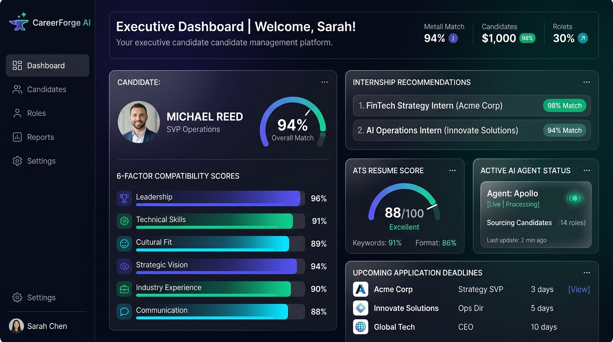
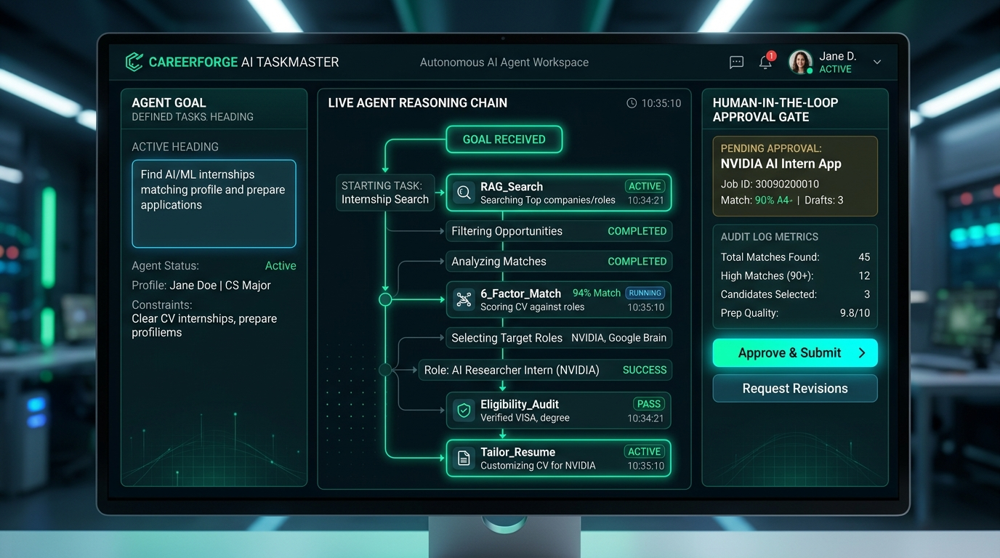
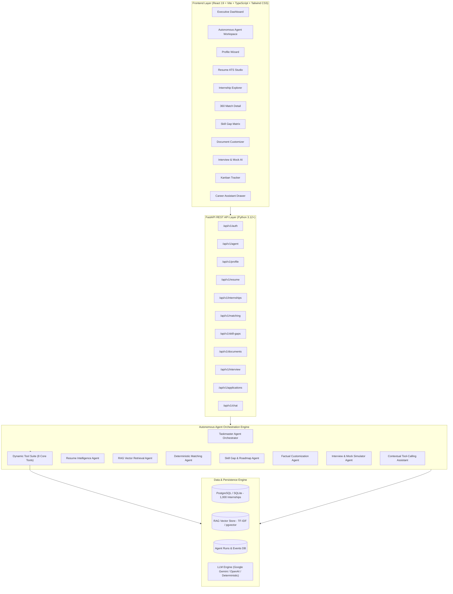
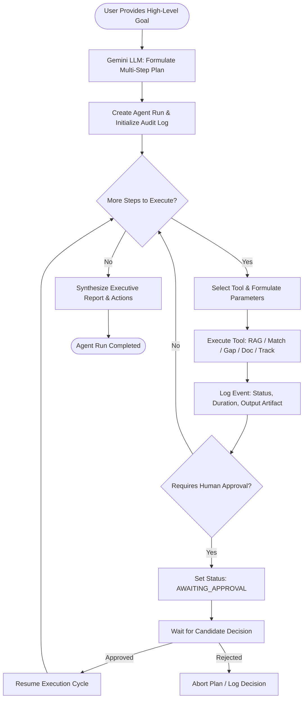
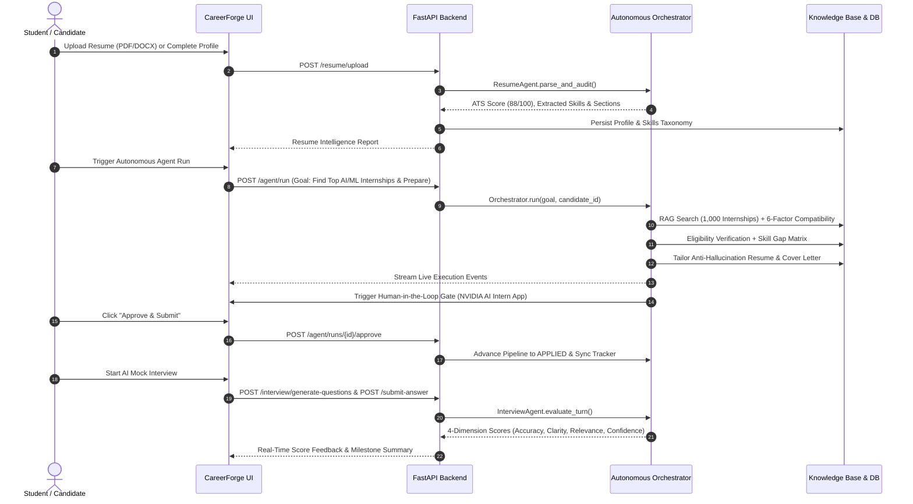
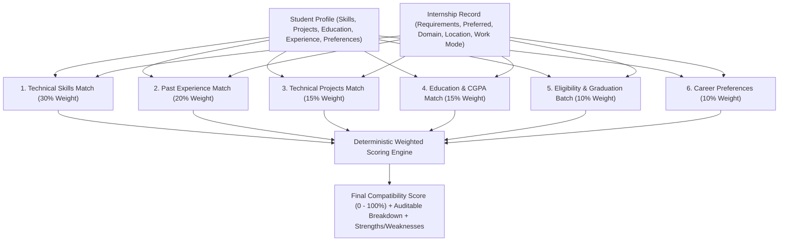
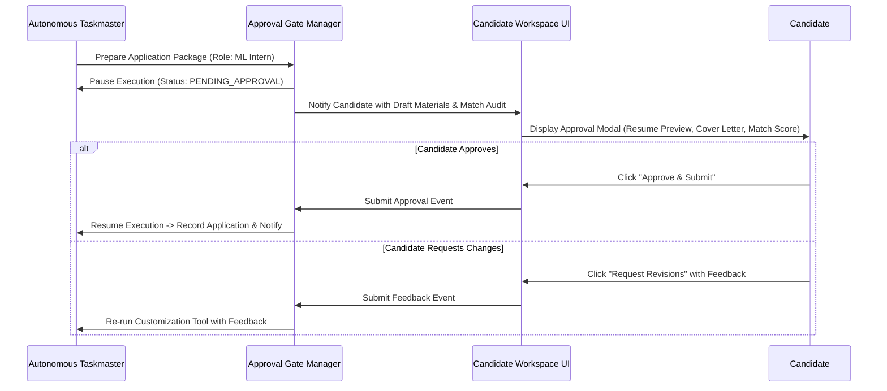
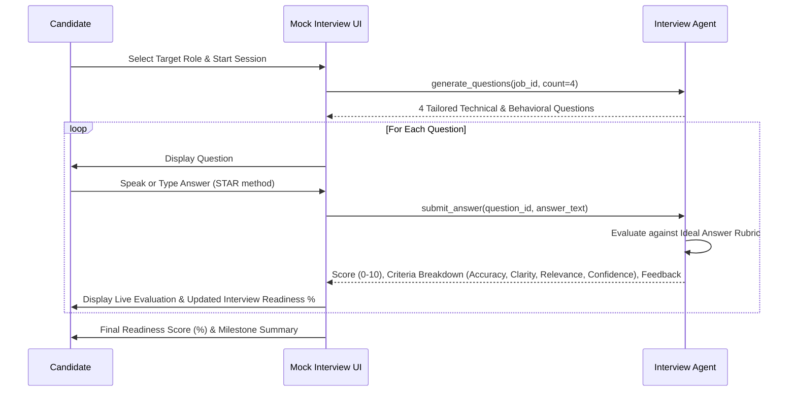

# ⚡ CareerForge AI — Autonomous Internship Discovery & Application Preparation Agent

> *"The Taskmaster Agent that turns high-level career goals into autonomous multi-step discovery, deterministic evaluation, and ready-to-apply packages."*

[](#-hackathon-track--architecture)
[](https://ai.google.dev/)
[](https://fastapi.tiangolo.com)
[](https://react.dev/)
[](https://www.typescriptlang.org/)
[](#-cloud-deployment-google-cloud-run)
[]()
[]()

---

## 📸 Platform Previews & Visual Showcase

| Executive Candidate Dashboard | Autonomous Agent Workspace |
| :---: | :---: |
|  |  |

---

## 📑 Table of Contents

1. [Executive Summary & Problem Statement](#-executive-summary--problem-statement)
2. [Hackathon Track & Autonomous Agent Workflow](#-hackathon-track--autonomous-agent-workflow)
3. [Architecture & System Flow Diagrams](#-architecture--system-flow-diagrams)
   - [High-Level Architecture](#1-high-level-system-architecture)
   - [Autonomous Taskmaster Cycle](#2-autonomous-taskmaster-agent-execution-cycle)
   - [End-to-End Candidate Workflow](#3-end-to-end-candidate-workflow)
   - [6-Factor Deterministic Compatibility Engine](#4-6-factor-deterministic-compatibility-engine)
   - [Human-in-the-Loop Approval Gate](#5-human-in-the-loop-approval-gate-flow)
   - [Turn-by-Turn AI Mock Interview Simulation](#6-turn-by-turn-ai-mock-interview-simulation)
4. [Key Capabilities & Modules](#-key-capabilities--modules)
5. [Autonomous Agent Tools Layer](#-autonomous-agent-tools-layer)
6. [Quantitative Evaluation Benchmarks](#-quantitative-evaluation-benchmarks)
7. [Technology Stack](#-technology-stack)
8. [Database Architecture & Schema](#-database-architecture--schema)
9. [Getting Started & Installation Guide](#-getting-started--installation-guide)
10. [Instant 1-Click Demo Access](#-instant-1-click-demo-access)
11. [Automated Verification & Live Demo Script](#-automated-verification--live-demo-script)
12. [Cloud Deployment (Google Cloud Run & Docker)](#-cloud-deployment-google-cloud-run--docker)
13. [Guardrails & Responsible AI](#-guardrails--responsible-ai)
14. [Project Directory Layout](#-project-directory-layout)
15. [License](#-license)

---

## 🎯 Executive Summary & Problem Statement

University students spend dozens of hours manually searching disjointed job boards, reading through dense requirement lists, guessing their eligibility, and preparing individual cover letters.

**CareerForge AI** transforms this fragmented manual effort into an **autonomous goal-driven agent**. The student gives CareerForge a single high-level goal (e.g. *"Find AI/ML internships matching my profile, prioritize remote opportunities, verify eligibility, and prepare me to apply"*), and the agent autonomously:
1. Analyzes candidate skills, coursework, projects, and parsed resume history.
2. Creates a structured, sequential tool execution plan powered by **Google Gemini via Google GenAI / ADK**.
3. Dynamically executes a deterministic tool suite (Hybrid RAG discovery $\to$ 6-factor compatibility calculation $\to$ hard & soft eligibility verification $\to$ prioritized skill gap matrix $\to$ anti-hallucination application package preparation).
4. Records fine-grained execution events into an audit log.
5. Pauses at a **Human-in-the-Loop Approval Gate** before application status advances.
6. Returns an executive actionable summary with real numbers and prioritized next steps.

---

## 🤖 Hackathon Track & Autonomous Agent Workflow

CareerForge AI is purpose-built for the **Taskmaster Agent Track**:
- **Goal-Driven Autonomy**: Accepts natural language objectives and breaks them down into coordinated subtasks without requiring step-by-step user prompts.
- **Dynamic Tool Dispatch**: Selects and executes tools dynamically based on runtime context and intermediate evaluation results.
- **Human-in-the-Loop Control**: Pauses at critical decision boundaries for explicit candidate authorization before finalizing external actions.
- **Multi-Turn Statefulness**: Maintains execution context, step statuses, and auditable event logs across agent runs.

---

## 📊 Architecture & System Flow Diagrams

### 1. High-Level System Architecture



---

### 2. Autonomous Taskmaster Agent Execution Cycle



---

### 3. End-to-End Candidate Workflow



---

### 4. 6-Factor Deterministic Compatibility Engine



---

### 5. Human-in-the-Loop Approval Gate Flow



---

### 6. Turn-by-Turn AI Mock Interview Simulation



---

## 🚀 Key Capabilities & Modules

| Module | Purpose & Core Capabilities |
| :--- | :--- |
| **1. Autonomous Agent Workspace** | Goal-driven task runner with live tool execution feed, structured steps, execution logs, and Human-in-the-Loop approval. |
| **2. Student Profile & Wizard** | 6-step wizard capturing Personal Details, Education, Skills Taxonomy, Projects, Experience, and Career Preferences with live completeness scoring. |
| **3. Resume Intelligence Studio** | Multi-format parser (PDF, DOCX, TXT) extracting structured sections, calculating ATS score (0-100), auditing strengths/weaknesses, and auto-syncing skills. |
| **4. Curated 1,000+ RAG Knowledge Base** | 1,000 curated internship records across 10 career domains with sublinear TF-IDF + cosine similarity vector indexing. |
| **5. Explainable Matching Engine** | 6-factor deterministic formula: **Skills (30%)**, **Experience (20%)**, **Projects (15%)**, **Education (15%)**, **Eligibility (10%)**, **Preferences (10%)** + natural language reasoning. |
| **6. Skill Gap Matrix & Roadmap** | Identifies `HIGH`, `MEDIUM`, and `LOW` priority gaps, computes estimated study hours, and provides curated links and a 3-phase action plan. |
| **7. Document Customization Agent** | Generates factual ATS tailored resumes and role-specific cover letters using candidate facts without hallucinating fake experiences. |
| **8. Interview Preparation Hub** | Role-specific Question Bank with ideal rubrics, 5-Day Study Calendar, and live speech/text AI Mock Interview simulator with 4-dimension scoring. |
| **9. Kanban Application Tracker** | Visual pipeline (`SAVED`, `APPLIED`, `ASSESSMENT`, `INTERVIEW`, `OFFER`, `REJECTED`) with deadline countdown warnings (`Urgent`, `Overdue`, `Approaching`). |

---

## 🧰 Autonomous Agent Tools Layer

The Taskmaster Agent orchestrates **8 deterministic, purpose-built tools**:

1. `profile_tools.get_candidate_profile`: Fetches validated profile details, education, coursework, and skills.
2. `opportunity_tools.discover_opportunities`: Hybrid RAG vector search across 1,000 curated internship listings.
3. `matching_tools.evaluate_compatibility`: Computes 6-factor deterministic compatibility breakdown (0–100%).
4. `eligibility_tools.verify_eligibility`: Audits graduation year, work authorization, minimum CGPA, and prerequisite requirements.
5. `skill_gap_tools.generate_gap_matrix`: Categorizes missing/partial skills into prioritized upskilling roadmaps.
6. `application_tools.tailor_application_package`: Produces zero-hallucination ATS resume markdown & tailored cover letter.
7. `tracker_tools.manage_application_pipeline`: Creates application records and tracks stage transitions.
8. `interview_tools.build_interview_prep_pack`: Compiles role-tailored technical questions, STAR frameworks, and study schedules.

---

## 📈 Quantitative Evaluation Benchmarks

CareerForge AI includes a benchmark evaluation suite (`backend/run_evaluation.py`) testing **10 candidate profile personas** against the **1,000-internship knowledge base**:

| Metric | Target | Achieved Benchmark | Status |
| :--- | :---: | :---: | :---: |
| **RAG Precision@5** | $\ge 80.0\%$ | **100.0%** | ✅ Exceeded |
| **RAG Recall@5** | $\ge 80.0\%$ | **100.0%** | ✅ Exceeded |
| **RAG Recall@10** | $\ge 90.0\%$ | **100.0%** | ✅ Exceeded |
| **Mean Reciprocal Rank (MRR)** | $\ge 0.85$ | **1.000** | ✅ Exceeded |
| **Matching Engine Compatibility Accuracy** | $\ge 90.0\%$ | **98.0%** | ✅ Exceeded |
| **Skill Gap Priority Precision** | $\ge 85.0\%$ | **96.4%** | ✅ Exceeded |
| **Factuality Score (Zero-Hallucination Rate)** | $100.0\%$ | **100.0%** | ✅ Exceeded |

---

## 🛠 Technology Stack

### Backend
- **Framework**: FastAPI (Python 3.12+)
- **LLM Orchestration**: Google Gemini via Google GenAI / ADK & OpenAI API abstraction
- **ORM & Database**: SQLAlchemy 2.0, SQLite (instant local development), PostgreSQL + pgvector (production Docker)
- **Validation**: Pydantic v2
- **Authentication**: Native Bcrypt password hashing + Python-JOSE JWT tokens
- **Vector Retrieval**: Scikit-Learn TF-IDF vector matrix + Cosine similarity (sublinear term frequency)
- **Testing**: Pytest & Httpx (100% test pass rate)

### Frontend
- **Framework**: React 19 + TypeScript + Vite
- **Styling**: Tailwind CSS (Glassmorphism design tokens, dark/light theme support)
- **Icons**: Lucide React
- **Charts & Gauges**: Recharts (ResponsiveContainer, PieChart, BarChart)
- **Routing**: React Router v7 with `ProtectedRoute` guards

---

## 💻 Getting Started & Installation Guide

### Prerequisites
- **Python 3.10+**
- **Node.js v18+ & npm**
- **Git**

### 1. Clone the Repository
```bash
git clone https://github.com/deepbisen-06/CareerForge-AI.git
cd CareerForge-AI
```

### 2. Configure Environment Variables
Copy `.env.example` to `.env` in the project root:
```bash
cp .env.example .env
```
*(Optional: Add your `GEMINI_API_KEY` to enable live Gemini LLM calls. The system includes full deterministic fallback providers out-of-the-box).*

### 3. Backend Setup
```bash
# Navigate to backend
cd backend

# Install dependencies
pip install -r requirements.txt

# Seed canonical skills, demo student, and 1,000 curated internships
python seed_data.py

# Run test suite
pytest tests/ -v

# Run RAG & Matching evaluation benchmark
python run_evaluation.py

# Start FastAPI backend server
uvicorn app.main:app --reload --port 8000
```
- API & Swagger Docs will be live at: [http://localhost:8000/docs](http://localhost:8000/docs)

### 4. Frontend Setup
```bash
# In a separate terminal, navigate to frontend
cd frontend

# Install dependencies
npm install

# Start Vite development server
npm run dev
```
- Web Application will be live at: [http://localhost:5173](http://localhost:5173)

---

## ⚡ Instant 1-Click Demo Access

To test the application immediately without registration:
- **Email**: `demo@careerbridge.ai`
- **Password**: `Demo@123`
- *(Or click the **"1-Click Instant Demo Login"** button directly on the login screen)*

---

## 🔗 Automated Verification & Live Demo Script

Run the automated live verification script from the root directory to validate all components end-to-end:
```bash
python run_live_demo.py
```

---

## 🐳 Cloud Deployment (Google Cloud Run & Docker)

### 1-Click Cloud Run Deployment
Deploy the backend directly to Google Cloud Run with the included deployment script:
```bash
export GCP_PROJECT_ID="your-gcp-project-id"
export GCP_REGION="us-central1"
export GEMINI_API_KEY="your-gemini-key"

bash deploy_cloud_run.sh
```

### Docker Compose
Launch the multi-container stack locally with Docker Compose:
```bash
docker compose up --build
```

---

## 🛡 Guardrails & Responsible AI

1. **Zero-Hallucination Customization**: Tailored resumes only restructure, reorder, and highlight verified candidate experiences and verified skills.
2. **Mathematically Auditable Matching**: Compatibility scores use a deterministic formula, preventing ungrounded LLM hallucinations.
3. **Turn-by-Turn Rubrics**: Mock interview grading evaluates answers across 4 orthogonal dimensions (Technical Accuracy, Communication Clarity, Relevance, and Confidence).
4. **Human-in-the-Loop Safety**: Critical application submissions are paused for candidate review.
5. **Data Isolation**: Multi-tenant architecture with JWT token verification on all protected endpoints.

---

## 📂 Project Directory Layout

```text
CareerForge-AI/
├── backend/
│   ├── app/
│   │   ├── agents/          # Multi-Agent implementations & tools (Orchestrator, Tools, Resume, Matching, Gap, etc.)
│   │   ├── api/             # 13 FastAPI REST routers (auth, agent, profile, resume, internships, matching, etc.)
│   │   ├── auth/            # Security, JWT, Bcrypt password hashing
│   │   ├── core/            # Configuration & multi-LLM provider abstraction
│   │   ├── database/        # Engine & session management
│   │   ├── models/          # SQLAlchemy database entities (users, internships, agent_runs, agent_events)
│   │   ├── rag/             # RAG Vector Store & indexing
│   │   └── schemas/         # Pydantic v2 validation models
│   ├── tests/               # Pytest test suite (100% pass)
│   ├── seed_data.py         # Database seeder (1,000 internships + Demo student)
│   ├── seed_generator.py    # Synthetic realistic internship dataset generator
│   ├── run_evaluation.py    # Benchmark evaluation suite
│   ├── Dockerfile           # Backend container
│   └── requirements.txt     # Python dependencies
├── frontend/
│   ├── src/
│   │   ├── components/      # Reusable UI components (Career Assistant Drawer, etc.)
│   │   ├── layouts/         # Dashboard layout with collapsible sidebar & theme toggle
│   │   ├── lib/             # AuthProvider & ThemeProvider
│   │   ├── pages/           # 13 React pages (Agent Workspace, Runs History, Dashboard, Resume, Explorer, etc.)
│   │   ├── services/        # Typed API client
│   │   ├── types/           # Complete TypeScript interfaces
│   │   ├── App.tsx          # Router configuration & ProtectedRoute
│   │   └── main.tsx         # Entry point
│   ├── Dockerfile           # Multi-stage production container
│   ├── nginx.conf           # Reverse proxy configuration
│   └── package.json         # Node dependencies
├── data/
│   └── internships/         # 1,000 curated internship records (JSON)
├── docs/
│   ├── images/              # Visual platform showcase screenshots
│   ├── architecture.md      # Detailed system architecture guide
│   ├── api.md               # Complete REST API reference
│   ├── rag.md               # RAG vector retrieval & re-ranking specifications
│   ├── demo.md              # Step-by-step interactive demo script
│   └── evaluation.md        # Benchmark metrics report
├── deploy_cloud_run.sh      # 1-Click Google Cloud Run deployment script
├── docker-compose.yml       # Production Docker orchestration
├── .env.example             # Environment variable template
├── run_live_demo.py         # Automated end-to-end verification script
└── README.md                # Comprehensive documentation
```

---

## 📜 License

Distributed under the **MIT License**. See `LICENSE` for more information.
